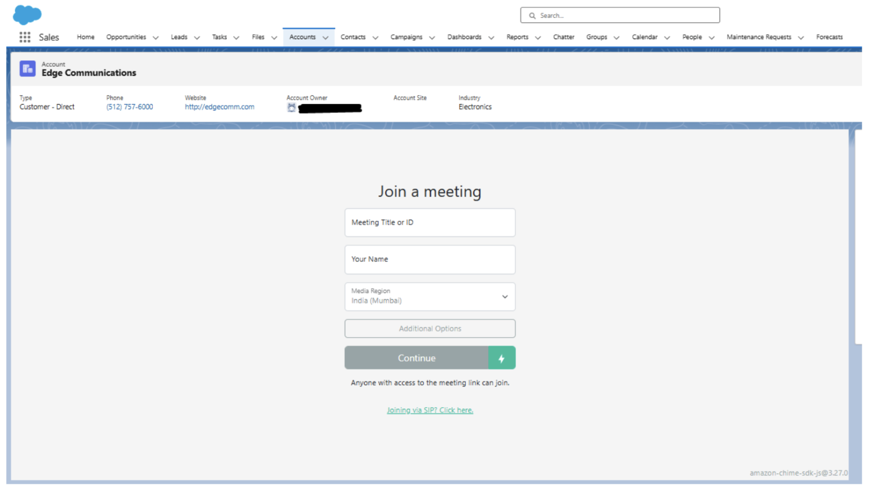
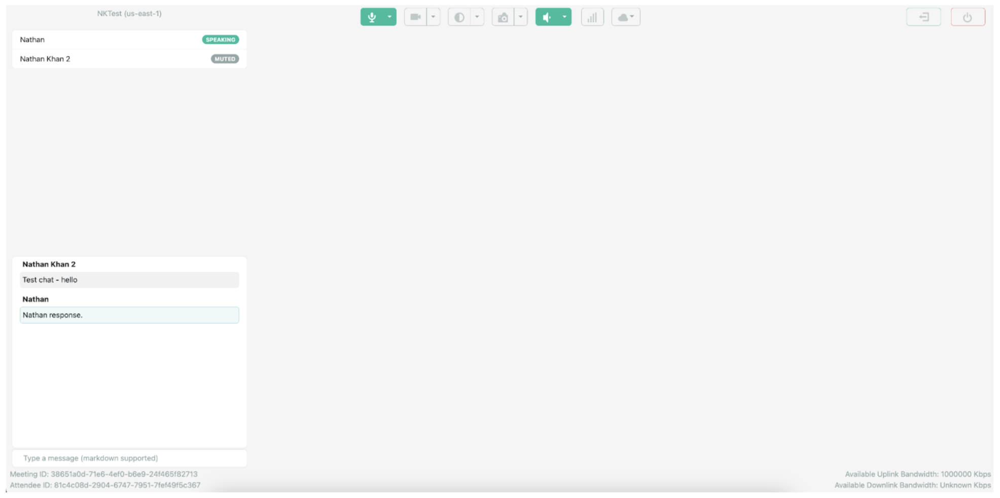
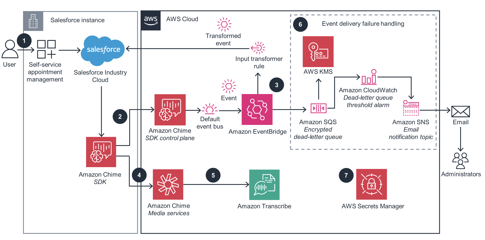

# 📹 Amazon Chime SDK Integration with Salesforce

## Overview

A comprehensive Salesforce integration with Amazon Chime SDK that enables real-time video conferencing and meeting recording capabilities directly within the Salesforce platform. Users can conduct online meetings without leaving Salesforce, with automated recording, participant tracking, and complete AWS infrastructure integration.

**Role:** Senior Salesforce Developer & AWS Integration Specialist  
**Duration:** 4 months

---

## The Problem

- **Application switching** - Users forced to leave Salesforce for video meetings
- **No native recording** - Manual recording and storage management required
- **Lost context** - Meeting data disconnected from Salesforce records
- **Complex workflows** - Multiple platforms for scheduling, meeting, and follow-up

---

## The Solution

### Key Features Built

✅ **In-Platform Video Conferencing** - Full Chime SDK meetings within Salesforce UI  
✅ **Automated Recording** - 1280x720 fidelity with automatic S3 storage  
✅ **Real-Time Participant Tracking** - Dynamic speaker highlighting and attendee list  
✅ **Recording Controls** - Start/stop recording via API Gateway integration  
✅ **Meeting Metadata** - Complete logging and traceability within Salesforce records  
✅ **Responsive Interface** - Mobile and desktop optimized meeting rooms

---

## Technical Implementation

### Architecture Overview
```
Salesforce Platform
       │
       ├── Lightning Web Components (iframe integration)
       │   └── Event handling & UI controls
       │
       ├── Apex Controllers
       │   └── AWS API integration via Named Credentials
       │
       └── HTTP Callouts
           │
           ▼
    API Gateway
           │
           ├─► Lambda Functions (Node.js)
           │   ├── Meeting management
           │   ├── Participant controls
           │   └── Recording triggers
           │
           ├─► ECS Fargate (Docker)
           │   ├── Recording service (FFmpeg)
           │   └── Auto-scaling cluster
           │
           └─► Storage & CDN
               ├── S3 Buckets (recordings)
               └── CloudFront (content delivery)
```

### AWS Infrastructure Components

**Serverless Services:**
- **Lambda Functions** - Meeting lifecycle management (Node.js)
- **API Gateway** - RESTful endpoints for Salesforce integration
- **CloudFormation** - Infrastructure as Code deployment
- **AWS SAM CLI** - Serverless application framework

**Container Services:**
- **ECS Fargate** - Docker-based recording service
- **ECR** - Container image repository
- **FFmpeg** - Video encoding and processing
- **Auto-scaling** - t2.2xlarge instances for stable performance

**Storage & CDN:**
- **S3 Buckets** - Secure meeting recording storage
- **CloudFront** - Global content delivery
- **Lifecycle Policies** - Automated storage management

### Tech Stack

| Layer | Technology |
|-------|-----------|
| **Frontend** | Lightning Web Components, JavaScript |
| **Backend** | Apex, AWS Lambda (Node.js) |
| **Infrastructure** | AWS CloudFormation, Docker, ECS |
| **APIs** | Amazon Chime SDK, API Gateway, REST |
| **Storage** | Amazon S3, CloudFront CDN |
| **Security** | AWS Signature authentication, Named Credentials |

---

## Screenshots

### Meeting Interface in Salesforce

*Real-time video conferencing directly within Salesforce with participant tracking*

### Meeting Controls

*Automated recording with start/stop controls and S3 integration*

### AWS Infrastructure Dashboard

*Complete serverless infrastructure with Lambda, ECS, and API Gateway*

---

## Key Technical Achievements

### 1. Dual AWS Serverless Architecture Integration

Successfully deployed and integrated two complex AWS serverless stacks:
- **Chime SDK Stack** - Meeting management infrastructure
- **Recording SDK Stack** - Docker-based recording service

Both deployed via CloudFormation with complete automation.

### 2. Secure AWS-Salesforce Communication Bridge

Implemented bidirectional communication:
```apex
// Apex integration with AWS Signature authentication
public class ChimeAPIService {
    @AuraEnabled
    public static String startMeeting(String meetingId) {
        HttpRequest req = new HttpRequest();
        req.setEndpoint('callout:AWS_Chime_API/start-meeting');
        req.setMethod('POST');
        req.setBody(JSON.serialize(new Map<String, String>{
            'meetingId' => meetingId
        }));
        
        Http http = new Http();
        HttpResponse res = http.send(req);
        return res.getBody();
    }
}
```

### 3. ECS Fargate Recording Service

Built Docker-based recording service with FFmpeg:
- Deployed to ECS Fargate with auto-scaling
- Optimized to t2.2xlarge instances for stable performance
- Automated S3 upload upon recording completion
```dockerfile
# Recording service container
FROM node:14
RUN apt-get update && apt-get install -y ffmpeg
COPY . /app
WORKDIR /app
CMD ["node", "recording-service.js"]
```

### 4. Real-Time Event Handling

Lightning Web Component with iframe integration:
```javascript
// LWC event handling for meeting controls
handleStartRecording() {
    this.template.querySelector('iframe')
        .contentWindow.postMessage({
            action: 'START_RECORDING'
        }, '*');
}
```

---

## Deployment Strategy

**Infrastructure Deployment:**
1. AWS SAM CLI for Lambda functions and API Gateway
2. CloudFormation stacks for complete infrastructure
3. Docker image build and push to ECR
4. ECS service deployment with auto-scaling configuration

**Salesforce Deployment:**
1. Lightning Web Components via SFDX
2. Apex classes and Named Credentials
3. Permission sets and security configuration
4. User training and documentation

---

## Security & Compliance

- AWS Signature v4 authentication for all API calls
- Encrypted S3 storage with bucket policies
- IAM roles with principle of least privilege
- Salesforce Named Credentials for secure credential storage
- Meeting data encryption in transit and at rest
- GDPR-compliant recording consent workflows

---

## Related Projects

Check out my other Salesforce integrations:
- [Payment Gateway Integration](https://github.com/Mutahar1/payment-gateway-integration) - Secure payment processing in Salesforce
- [AI-Powered Case Summary](https://github.com/Mutahar1/agentforce-ai-case-summary) - Einstein AI integration
- [Email Threading System](https://github.com/Mutahar1/email-threading-system) - Custom email automation

---

<div align="center">

**Questions about this project?**

📧 [Email](mailto:murtazamutahar@gmail.com) | 💼 [LinkedIn](https://www.linkedin.com/in/mutahar-murtaza-salesforce/) | 🏔️ [Trailblazer](https://www.salesforce.com/trailblazer/mmurtaza4)

---

Built by Mutahar | Senior Salesforce Developer

</div>
